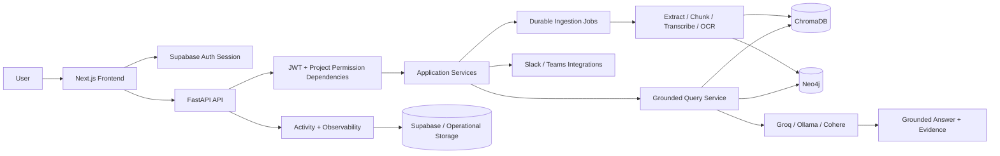

# Recall.AI — Complete Project Documentation and Future Scope

> **Document status:** Current implementation reference
>
> **Project:** Recall.AI
>
> **Repository:** `recallAi`
>
> **Last reviewed:** 17 August 2026

## 1. Executive Summary

Recall.AI is a multi-tenant organizational memory platform. It collects knowledge from documents, conversations, meeting transcripts, and connected collaboration systems; converts that material into both searchable text memory and structured organizational knowledge; and answers natural-language questions with traceable evidence.

The central product idea is simple: organizations contain valuable decisions, context, trade-offs, ownership information, deadlines, and historical reasoning, but that information is normally fragmented across files, chat channels, meetings, and individual memory. Recall.AI provides a persistent memory layer that allows a user to ask questions such as:

- Why was a technology or architecture decision made?
- Who owned a particular implementation or risk?
- What alternatives were considered?
- What did a meeting decide and what actions followed?
- Which source supports a generated answer?
- How are decisions, people, reasons, alternatives, and impacts connected?

The current system combines:

1. A Next.js web application for authentication, workspace management, ingestion, querying, graph exploration, integrations, activity, and settings.
2. A FastAPI backend that exposes authenticated, project-scoped APIs.
3. Neo4j for structured knowledge, operational job state, project metadata, integration connections, and graph traversal.
4. ChromaDB for semantic vector retrieval over source text and transcripts.
5. Supabase for authentication, relational operational data, storage-related configuration, and migrations used by observability/activity functionality.
6. Groq and optional Ollama/Cohere providers for generation, extraction, embeddings, and transcription-related workloads.

## 2. Problem Statement

Knowledge loss is an operational risk. A company may have the source code and documents but still lose the reasoning that explains them. Important information is frequently:

- Distributed across PDFs, spreadsheets, images, audio, Slack, Microsoft Teams, and internal notes.
- Written with inconsistent terminology and incomplete metadata.
- Difficult to locate through keyword search alone.
- Dependent on relationships: people, decisions, reasons, alternatives, impact, dates, and project context.
- Locked inside meetings and conversations that new team members cannot efficiently review.

Recall.AI addresses this by preserving raw source context while also extracting structured knowledge. It does not treat a generated answer as the source of truth; the answer is grounded in tenant-scoped evidence and exposes provenance metadata whenever available.

## 3. Product Goals

### Current goals

- Preserve organizational knowledge in a reusable, searchable form.
- Support isolated workspaces and project-level access control.
- Ingest multiple source types through a common processing model.
- Combine semantic retrieval with graph/full-text retrieval.
- Return answers that are grounded in source evidence.
- Make extracted decisions and relationships explorable visually.
- Provide durable ingestion behavior with retries, leases, checkpoints, and stale-job recovery.
- Support real integrations where credentials and provider configuration are available.

### Non-goals of the current implementation

- Recall.AI is not yet a complete enterprise content-management system.
- It is not a replacement for Slack, Microsoft Teams, cloud storage, or an organization's source-of-record systems.
- It does not currently provide a fully autonomous workflow engine for acting on every extracted task or decision.
- It does not guarantee perfect factuality when source material is incomplete, contradictory, poorly transcribed, or ambiguous.

## 4. Current Feature Inventory

### 4.1 Authentication and account access

- Supabase-backed user authentication is integrated into the frontend.
- Sign-up, login, and forgot-password screens are present.
- The frontend maintains the authenticated session and passes bearer credentials to the backend.
- The API validates the JWT and derives the authenticated user, organization, permissions, and project context.
- The frontend API wrapper handles authenticated requests and token refresh behavior.
- Unauthorized requests are surfaced through a consistent client-side request flow.

### 4.2 Organizations, workspaces, and projects

The application uses a hierarchy of organization, project/workspace, and user membership.

- A user can work inside a selected active workspace.
- Workspaces are isolated knowledge boundaries.
- A default workspace can be initialized for a user.
- Projects can be listed, created, initialized, updated, and deleted.
- Project members can be listed and their roles can be changed.
- Organization summaries are available through the project API.
- Project and organization identifiers are propagated into ingestion, retrieval, graph, activity, and integration operations.
- Destructive workspace deletion attempts to remove associated graph and vector data as part of cleanup.

### 4.3 Role and permission model

The backend uses explicit permission checks rather than relying only on frontend visibility. Current permission concepts include:

| Permission | Typical use |
|---|---|
| `knowledge:read` | Query knowledge, inspect the graph, inspect indexed meetings |
| `knowledge:write` | Upload files, ingest Slack, synchronize Teams |
| `project:read` | Read project context, members, activity, and integration status |
| `project:manage` | Manage workspace-level controls and Teams connection lifecycle |

Project roles represented in request validation include `ADMIN`, `MANAGER`, `CONTRIBUTOR`, and `VIEWER`. Exact permission mapping is enforced by backend dependencies and project service logic.

### 4.4 File and source ingestion

The universal upload endpoint accepts an uploaded file and creates an asynchronous ingestion job. The implementation includes compatibility endpoints for audio and image uploads, while the universal runner determines the processing path.

Supported or prepared source categories include:

- PDF and document text extraction.
- Plain text/document-style input.
- Excel workbooks using `openpyxl`.
- Images using OCR/vision-capable provider paths.
- Audio using transcription provider paths.
- Video as a recognized job source category where a compatible input path is configured.
- Slack channels.
- Microsoft Teams meeting transcripts and meeting metadata.

The configured upload-size ceiling is 25 MB unless overridden through configuration.

### 4.5 Durable asynchronous ingestion jobs

Ingestion is represented by a durable `IngestionJob` model. Jobs track:

- Organization, project, user, source type, and source identifier.
- Durable input payload or input URI.
- Filename, content type, size, checksum, and source configuration.
- Current status and processing stage.
- Progress, total units, and completed units.
- Retry count, attempt number, error message, and timestamps.
- Lease owner and lease expiration.
- Optimistic version number.
- Checkpoint state and checkpoint sequence.

Current job statuses are:

```text
QUEUED -> PROCESSING -> COMPLETED
                  |-> FAILED
                  |-> CANCELLED
                  |-> STALE -> PROCESSING
```

Current processing stages are:

```text
VALIDATE
REGISTER_SOURCE
EXTRACT_TEXT
CHUNK
EMBED
STORE_SEMANTIC_MEMORY
EXTRACT_STRUCTURED_KNOWLEDGE
WRITE_KNOWLEDGE_GRAPH
FINALIZE
```

The job system supports:

- Background dispatch through FastAPI background tasks.
- Job claiming using a worker lease.
- Version-aware state transitions.
- Lease release after processing.
- Completion and failure operations scoped to the active worker and expected version.
- Cancellation.
- Retry of jobs that are eligible for retry.
- Reclamation of expired processing leases.
- Stale-job detection and recovery.
- Per-chunk processing claims through `ProcessingLedger`.
- Idempotent processing based on deterministic source/chunk identity and content hashes.

This architecture reduces duplicate work when a request is retried or a worker stops partway through a large source.

### 4.6 Document processing pipeline

The common document flow is:

```text
Upload
  -> Validate size and metadata
  -> Register source and create job
  -> Extract raw text
  -> Split text into chunks
  -> Generate embeddings
  -> Store semantic chunks in ChromaDB
  -> Extract structured knowledge with an LLM
  -> Write decisions and relationships to Neo4j
  -> Finalize job and publish activity
```

The extraction model is designed to identify knowledge such as:

- Decisions/actions.
- Subjects/topics.
- Reasons.
- People involved.
- Alternatives considered.
- Organizational or technical impact.
- Meeting-specific knowledge such as action items, participants, deadlines, and categories.

The source text remains part of the semantic memory path, so a user can retrieve the original context even when structured extraction is incomplete.

### 4.7 Slack ingestion

The Slack ingestion endpoint accepts a validated channel identifier and a message limit. The Slack runner:

- Uses the configured Slack bot token.
- Fetches channel history incrementally.
- Tracks the latest timestamp for the channel in the project scope.
- Converts messages to chronological text.
- Registers or updates Slack channel/message graph entities.
- Uses deterministic message identity to avoid duplicate ingestion.
- Runs through the same semantic and structured knowledge paths used by other sources.
- Creates an asynchronous job and activity event.

The current request limit is bounded by validation and the configured ingestion rate limiter. The request model allows a message limit from 1 to 500.

### 4.8 Microsoft Teams integration

Microsoft Teams is implemented as a project-level integration with OAuth and synchronization support.

Current capabilities include:

- Generate an OAuth connection URL.
- Complete the OAuth callback.
- Encrypt stored access and refresh tokens.
- Expose connection status.
- Disconnect the project connection.
- List indexed meetings.
- Retrieve detailed meeting knowledge.
- Start a background meeting synchronization job.
- Handle Microsoft Graph validation-token handshakes.
- Validate configured webhook client state for notification processing.
- Renew subscriptions during backend lifecycle processing when configured.
- Store meeting metadata, transcript text, processing state, and extracted knowledge.

The Teams frontend exposes connected/not-connected state, account information, connection update time, meeting count, manual synchronization, meeting selection, participants, and extracted knowledge items.

### 4.9 Hybrid retrieval

Recall.AI uses two complementary retrieval systems:

1. **Semantic retrieval:** ChromaDB returns text chunks that are semantically similar to the question.
2. **Structured/full-text retrieval:** Neo4j returns decisions and connected entities that match the question and project scope.

The grounded retrieval service:

- Parses source filters and supported metadata filters.
- Detects identifiers in questions, including quoted identifiers and common document/ticket-like patterns.
- Queries Neo4j and ChromaDB under the current organization and project scope.
- Converts results into a common `Evidence` representation.
- Removes duplicates using deterministic evidence IDs.
- Merges retrieval-source metadata when the same evidence is found through multiple paths.
- Applies lexical overlap, identifier, metadata, relevance, and multi-source bonuses.
- Expands around matching document sections when section metadata is available.
- Selects evidence hierarchically to avoid returning only repetitive chunks from one location.
- Limits the final evidence context to a bounded set before generation.

The evidence model contains an evidence ID, tenant identifiers, document ID, source type, content, optional relevance score, and provenance metadata.

### 4.10 Grounded answers and answer states

Query responses can distinguish at least three semantic outcomes:

- `answerable`: sufficient relevant evidence was found.
- `insufficient_evidence`: the system could not find enough relevant support.
- `conflicting_evidence`: the retrieved material contains meaningful disagreement, such as multiple dates or multiple reasons.

The service can detect temporal and reason conflicts before generation. Long evidence is compressed into a relevant span with offsets so the answer context remains bounded while preserving traceability metadata.

The response includes the original question, generated result fields, agent/provider information where available, timestamp, evidence/provenance fields, and retrieval metadata.

### 4.11 Query routing and agents

The backend contains agent modules for:

- Query handling.
- Ingestion/extraction.
- Impact-oriented reasoning.
- Agent routing.

The routing layer allows the system to select the appropriate reasoning path instead of treating every request as identical. Provider selection can be supplied through the `X-LLM-Provider` request header, with Groq as the default path.

### 4.12 Knowledge graph visualization

The graph endpoint returns a paginated graph representation for the active project.

The current graph response contains:

- Decision nodes.
- Person nodes.
- Reason nodes.
- Alternative nodes.
- Decision-to-person `MADE_BY` edges.
- Decision-to-reason `BASED_ON` edges.
- Decision-to-alternative `ALTERNATIVE` edges.
- Pagination metadata and total decision count.

The frontend provides:

- Interactive 2D/3D graph visualization dependencies.
- Pan and zoom interaction.
- Node selection.
- Connected-entity highlighting.
- An inspector showing type, subject, impact, source, and connected entity count.
- Incremental loading of additional decisions.
- Empty, loading, and error states.

### 4.13 Activity feed

The activity API returns project- and organization-scoped events. The frontend supports:

- Search by title, description, or source.
- Filtering by event type.
- Manual refresh.
- Automatic refresh every 30 seconds.
- Event presentation for ingestion, query, Slack, impact, and email-style event categories where present in the event store.

Activity events provide a useful operational timeline for understanding what was ingested, queried, synchronized, or otherwise processed.

### 4.14 Observability and operational controls

The observability service includes:

- Provider and dependency metrics.
- Request/error tracking hooks.
- Circuit breakers for Groq, Ollama, Cohere, Neo4j, and Chroma.
- Query cache key generation scoped by organization, project, user, provider, source filter, and normalized question.
- Configurable query cache TTL and maximum entries.
- Configurable error-rate alert threshold.
- Provider dashboard and alerts endpoints.
- Provider budget update endpoint.

Cost configuration supports provider-specific token and transcription cost fields so operational spend can be calculated when pricing values are supplied.

### 4.15 Frontend experience

The Next.js App Router application currently includes:

| Route | Purpose |
|---|---|
| `/` | Main workspace/dashboard entry point |
| `/login` | Sign in |
| `/signup` | Create an account |
| `/forgot-password` | Password recovery |
| `/query` | Ask questions and add knowledge |
| `/sources` | Browse/manage indexed sources |
| `/graph` | Explore the decision graph |
| `/teams` | Connect Teams, sync meetings, inspect meeting knowledge |
| `/activity` | Review workspace history |
| `/settings` | Review account and active workspace settings |

Reusable UI components include navigation, footer, source cards, file selection, agent badges, workspace management, dialogs, tabs, cards, badges, inputs, buttons, and loading/error/empty states.

The UI uses Tailwind CSS, Radix primitives, Lucide icons, Framer Motion/GSAP, and graph/Three.js dependencies for interactive presentation.

## 5. System Architecture



### 5.1 Frontend layer

The frontend is a Next.js 16 App Router application using React 19 and TypeScript. It manages:

- Route-level screens.
- Session-aware navigation.
- Active project selection.
- Permission-aware controls.
- API requests through `frontend/lib/api.ts`.
- Loading, retry, empty, and error states.
- Source upload and job polling interactions.
- Graph and meeting inspection interfaces.

### 5.2 API layer

The FastAPI backend is organized around routers. API responsibilities include:

- Parsing and validating request input.
- Resolving authenticated user context.
- Resolving active project context.
- Enforcing permission and rate-limit dependencies.
- Dispatching application services.
- Returning stable JSON responses and domain errors.

### 5.3 Application-service layer

Services hold business orchestration rather than putting all logic in route handlers. Important services include:

- `AuthService`: authenticated user and JWT-related context.
- `ProjectService`: project lifecycle, membership, permissions, and cleanup.
- `IngestionService`: upload and integration ingestion orchestration.
- `JobService`: job creation, retrieval, transition, cancellation, retry, leases, and recovery.
- `QueryService`: query caching, agent execution, activity recording, and response coordination.
- `GroundedQueryService`: retrieval, evidence normalization, ranking, conflict detection, context construction, and grounded generation.
- `TeamsService`: OAuth, encrypted credentials, connection state, subscriptions, meetings, and synchronization.
- `ObservabilityService`: metrics, provider state, circuit breakers, caching, and budgets.

### 5.4 Persistence responsibilities

| System | Primary responsibility | Typical data |
|---|---|---|
| Supabase Auth | Identity and session management | Users, JWT sessions |
| Supabase/Postgres | Relational operational concerns | Activity/observability migrations and related operational records |
| Supabase Storage/configuration | Durable storage integration path | Uploaded source objects where configured |
| Neo4j | Relationships and structured operational graph | Projects, members, decisions, people, reasons, alternatives, meetings, Slack records, jobs, processing ledger |
| ChromaDB | Semantic retrieval | Embedded chunks, source metadata, transcript text |

The repository contains both Neo4j-backed operational components and Supabase-backed services/migrations. Deployments should treat the configured adapters and migration state as the source of truth for a particular environment.

## 6. Data and Knowledge Model

### 6.1 Tenant scope

Every sensitive operation should be constrained by both:

```text
organization_id + project_id
```

The authenticated request context supplies those values. Retrieval code validates them again when converting database records to evidence. This defense-in-depth approach is important because a vector or graph query must not be allowed to return records from another workspace.

### 6.2 Structured knowledge

The graph can represent concepts such as:

- Organization.
- Project/workspace.
- User/member.
- File/document.
- Decision.
- Person.
- Reason.
- Alternative.
- Meeting.
- Slack channel/message.
- Teams connection and subscription.
- Ingestion job.
- Processed chunk.

Representative relationships include:

```text
Decision -[:MADE_BY]-> Person
Decision -[:BASED_ON]-> Reason
Decision -[:ALTERNATIVE]-> Alternative
```

Additional source-specific relationships and metadata are stored as the integration runners require.

### 6.3 Semantic memory

Each chunk stored in ChromaDB should carry enough metadata to identify:

- Organization and project.
- Source and document ID.
- Chunk ID.
- Source type.
- Page, section, sheet, row, timestamp, or meeting metadata when available.
- Retrieval source and relevance details when returned.

This metadata enables exact filtering, hierarchical expansion, provenance, and tenant validation.

### 6.4 Evidence contract

The `Evidence` domain object is the common contract between retrieval and answer generation. It prevents the generation layer from receiving unstructured database records without scope or provenance fields.

An evidence record contains:

```text
evidence_id
organization_id
project_id
document_id
source_type
content
relevance_score
metadata
```

## 7. API Reference

All protected endpoints require a valid bearer token and, where applicable, a project permission. The backend is mounted from `backend/main.py` and route prefixes are defined in the individual routers.

### 7.1 Health

| Method | Endpoint | Description |
|---|---|---|
| `GET` | `/health` | Returns API status and Neo4j connectivity status. |

### 7.2 Projects and memberships

| Method | Endpoint | Description |
|---|---|---|
| `GET` | `/projects` | List projects available to the authenticated user. |
| `GET` | `/projects/active` | Resolve the active project context. |
| `POST` | `/projects` | Create a project. |
| `POST` | `/projects/init` | Initialize/bootstrap the default workspace. |
| `DELETE` | `/projects/{project_id}` | Delete a project if authorized. |
| `PATCH` | `/projects/{project_id}` | Update a project name or project fields. |
| `GET` | `/projects/{project_id}/members` | List project members. |
| `PATCH` | `/projects/{project_id}/members/{member_id}` | Update a member role. |
| `GET` | `/projects/organization/summary` | Return organization-level summary information. |

### 7.3 Ingestion and jobs

| Method | Endpoint | Description |
|---|---|---|
| `POST` | `/ingest/upload` | Upload a source file and enqueue processing. |
| `POST` | `/ingest/audio` | Compatibility upload endpoint for audio. |
| `POST` | `/ingest/image` | Compatibility upload endpoint for image/OCR input. |
| `POST` | `/ingest/slack` | Enqueue Slack channel ingestion. |
| `GET` | `/ingest/status/{job_id}` | Read a scoped job status. |
| `POST` | `/ingest/{job_id}/cancel` | Cancel an authorized job. |
| `POST` | `/ingest/{job_id}/retry` | Retry an eligible job and dispatch it. |

The `X-LLM-Provider` header can select the configured LLM provider; the default is `groq`.

### 7.4 Querying

| Method | Endpoint | Description |
|---|---|---|
| `POST` | `/query` | Ask a natural-language question against the active project knowledge base. |

Request shape:

```json
{
  "question": "Why was the reporting API migration delayed?",
  "source_filter": "optional-source-id"
}
```

Question length is limited to 2,000 characters and source-filter length to 500 characters by request validation.

### 7.5 Graph

| Method | Endpoint | Description |
|---|---|---|
| `GET` | `/graph/data?limit=100&offset=0` | Return paginated decision-centered graph data. |

The graph endpoint caps the requested page size at 200 decisions.

### 7.6 Activity

| Method | Endpoint | Description |
|---|---|---|
| `GET` | `/activity?limit=50` | Return project-scoped activity events. |

The activity limit is bounded between 1 and 100.

### 7.7 Microsoft Teams

| Method | Endpoint | Description |
|---|---|---|
| `GET` | `/integrations/teams/connect` | Return an OAuth connection URL. |
| `GET` | `/integrations/teams/oauth/callback` | Complete OAuth and redirect to the frontend. |
| `GET` | `/integrations/teams/status` | Return project Teams connection status. |
| `DELETE` | `/integrations/teams/connection` | Disconnect Teams. |
| `GET` | `/integrations/teams/meetings` | List indexed meetings. |
| `GET` | `/integrations/teams/meetings/{meeting_id}` | Read meeting details and extracted knowledge. |
| `POST` | `/integrations/teams/sync` | Start a Teams synchronization job. |
| `POST` | `/integrations/teams/notifications` | Handle Graph validation and notification events. |

### 7.8 Observability

| Method | Endpoint | Description |
|---|---|---|
| `GET` | `/observability/dashboard` | Return operational dashboard information. |
| `GET` | `/observability/alerts` | Return configured/observed alerts. |
| `GET` | `/observability/providers` | Return provider health and usage information. |
| `PUT` | `/observability/budget` | Update a budget record. |

## 8. End-to-End Workflows

### 8.1 New user and workspace flow

1. The user signs up through Supabase Auth.
2. The frontend establishes a session.
3. The frontend calls project initialization/listing APIs.
4. The backend resolves the user's organization and memberships.
5. A default workspace can be created exactly once where required.
6. The frontend selects the active workspace.
7. All subsequent source, graph, activity, and query requests use that project context.

### 8.2 File upload flow

1. The user opens the query/source experience and selects a file.
2. The frontend sends a multipart request to `/ingest/upload`.
3. The API validates authentication, project permission, rate limit, and file size.
4. `IngestionService` registers a durable source/job.
5. A background task dispatches the correct runner.
6. The runner claims the job lease.
7. The source is parsed, chunked, embedded, and stored.
8. Structured knowledge is extracted and written to Neo4j.
9. The job is finalized as completed or failed.
10. The frontend polls the job and displays source/activity state.

### 8.3 Query flow

1. The user asks a question from the active workspace.
2. The frontend sends the question to `/query`.
3. The API authenticates the request and checks `knowledge:read`.
4. Query caching is checked using a tenant- and provider-scoped key.
5. Retrieval filters and identifiers are parsed.
6. Neo4j and ChromaDB are queried in the project scope.
7. Evidence is normalized, deduplicated, ranked, and optionally expanded by section.
8. Relevance and conflict checks determine the answer state.
9. The configured agent/LLM synthesizes the answer from bounded evidence.
10. The answer, evidence, provenance, metadata, and activity event are returned.

### 8.4 Teams connection and synchronization flow

1. A project manager selects Connect Teams.
2. The frontend requests `/integrations/teams/connect`.
3. The backend creates a signed OAuth state and returns the provider URL.
4. Microsoft redirects to `/integrations/teams/oauth/callback`.
5. Tokens are exchanged and encrypted before storage.
6. A Teams connection/subscription is associated with the project.
7. The user can start `/integrations/teams/sync`.
8. The sync job retrieves available meeting/transcript information.
9. Meeting text enters the semantic and structured knowledge pipeline.
10. The frontend displays indexed meetings and extracted knowledge items.

## 9. Security and Isolation

Current security controls include:

- JWT-based authentication.
- Project permission dependencies on protected API routes.
- Organization/project scoping in graph and vector retrieval.
- Job authorization checks for owner, organization, and project alignment.
- Validated input models and field bounds.
- Rate limiting for ingestion, queries, Slack ingestion, and Teams synchronization.
- Encrypted Microsoft Teams tokens.
- Signed and expiring Teams OAuth state.
- Teams webhook client-state validation.
- CORS configuration.
- Centralized error handling and request context infrastructure.
- Evidence-level tenant validation before generated context is assembled.

Important operational note: application-layer tenant enforcement is currently a major isolation boundary. Full database Row Level Security coverage across every relational table is a future hardening item and should be treated as a release requirement for a larger enterprise deployment.

## 10. Reliability and Idempotency

The system includes multiple reliability mechanisms:

### Job-level reliability

- A job is claimed only when it is queued/stale and has no active lease.
- Lease expiration allows another worker to reclaim abandoned work.
- Version checks prevent stale workers from overwriting newer state.
- Completion/failure requires the current worker and expected version.
- Retry preserves enough durable input information to reconstruct processing.

### Chunk-level reliability

- `ProcessingLedger` tracks organization, project, job, chunk index, content hash, worker, status, attempts, and timestamps.
- Processing claims can be reclaimed after a chunk-level timeout.
- Completed chunks are not processed again unnecessarily.

### Source-level idempotency

- Source and message identity are deterministic where possible.
- Chunk IDs and evidence IDs are hash-derived.
- Slack messages and Teams meetings use external/source identifiers.
- Duplicate retrieval results are merged rather than repeated.

## 11. Configuration Reference

The backend reads environment settings through `backend/core/config.py`. The most important settings are:

| Variable | Purpose |
|---|---|
| `GROQ_API_KEY` | Groq LLM/transcription access |
| `NEO4J_URI` | Neo4j connection URI |
| `NEO4J_USERNAME` | Neo4j username |
| `NEO4J_PASSWORD` | Neo4j password |
| `CHROMA_TENANT` | Chroma tenant |
| `CHROMA_API_KEY` | Chroma authentication |
| `CHROMA_DATABASE` | Chroma database name |
| `COHERE_API_KEY` | Optional Cohere provider/embedding access |
| `OLLAMA_MODEL` | Local Ollama text model |
| `OLLAMA_BASE_URL` | Ollama server URL |
| `OLLAMA_VISION_MODEL` | Ollama vision model for image workloads |
| `GROQ_VISION_MODEL` | Groq-compatible vision model |
| `SUPABASE_URL` | Supabase project URL |
| `SUPABASE_PUBLISHABLE_KEY` | Frontend/backend publishable key |
| `SUPABASE_SERVICE_ROLE_KEY` | Server-side Supabase operations |
| `SUPABASE_JWT_AUDIENCE` | JWT audience, default `authenticated` |
| `SUPABASE_JWT_ISSUER` | JWT issuer |
| `CORS_ORIGINS` | Allowed frontend origins |
| `FRONTEND_URL` | Redirect target for integrations |
| `SLACK_BOT_TOKEN` | Slack API access |
| `MICROSOFT_CLIENT_ID` | Microsoft OAuth client ID |
| `MICROSOFT_CLIENT_SECRET` | Microsoft OAuth client secret |
| `MICROSOFT_TENANT_ID` | Microsoft tenant, default `common` |
| `MICROSOFT_REDIRECT_URI` | Teams OAuth callback URL |
| `TEAMS_TOKEN_ENCRYPTION_KEY` | Teams token encryption key |
| `GRAPH_WEBHOOK_URL` | Microsoft Graph notification URL |
| `TEAMS_WEBHOOK_CLIENT_STATE` | Notification authenticity value |
| `MOCK_TEAMS_TRANSCRIPTS` | Enable configured mock transcript behavior |
| `MAX_UPLOAD_SIZE_BYTES` | Upload limit, default 25 MB |
| `LOG_LEVEL` | Backend logging level |
| `QUERY_CACHE_TTL_SECONDS` | Query cache lifetime |
| `QUERY_CACHE_MAX_ENTRIES` | Maximum query cache entries |
| `OBSERVABILITY_ALERT_ERROR_RATE` | Error-rate alert threshold |
| `GROQ_COST_PER_1K_TOKENS` | Groq cost accounting |
| `COHERE_COST_PER_1K_TOKENS` | Cohere cost accounting |
| `GROQ_TRANSCRIPTION_COST_PER_MINUTE` | Transcription cost accounting |

Frontend configuration is expected to include:

```text
NEXT_PUBLIC_SUPABASE_URL
NEXT_PUBLIC_SUPABASE_ANON_KEY
NEXT_PUBLIC_API_URL
```

Secrets must remain server-side and must not be committed to the repository.

## 12. Local Development

### Backend

```powershell
cd backend
python -m venv venv
venv\Scripts\Activate.ps1
pip install -r requirements.txt
uvicorn main:app --reload
```

The backend is available at `http://localhost:8000`. FastAPI documentation is available at `/docs`.

### Frontend

```powershell
cd frontend
npm install
npm run dev
```

The frontend is available at `http://localhost:3000`.

### Useful validation commands

```powershell
cd backend
pytest

cd ..\frontend
npm run lint
npm run build
npm run test:e2e
```

Before running end-to-end tests, configure the required backend services and frontend/backend environment variables.

## 13. Deployment Shape

The repository includes a Render configuration for the backend. The deployment model is:

- Frontend: Next.js deployment, suitable for Vercel or another Node-compatible host.
- Backend: Python/FastAPI deployment, currently configured for Render-style deployment.
- Neo4j: Managed or externally hosted graph database.
- ChromaDB: Cloud or configured vector database endpoint.
- Supabase: Managed authentication and operational database services.
- LLM providers: Groq, with optional Ollama/Cohere paths.

Production deployment must configure:

- Stable frontend and backend URLs.
- CORS origins.
- Supabase issuer/audience values.
- Neo4j indexes and constraints.
- Chroma tenant/database/API credentials.
- Teams redirect and webhook URLs.
- Encryption keys and provider secrets.
- Logging and error alert thresholds.

## 14. Testing Coverage

The backend test suite includes coverage areas for:

- Authentication service behavior.
- Critical API flows.
- Grounded query behavior.
- Job processing.
- File delete/re-ingest behavior.
- Teams integration.
- Tenant isolation.
- Observability.
- Request validation.

The frontend contains a Playwright test for knowledge access. The most valuable tests to maintain as the system evolves are tenant-isolation tests, authorization tests, retry/recovery tests, grounded-answer tests, integration callback tests, and full upload-to-query tests.

## 15. Current Limitations and Risks

### Product limitations

- Source coverage and parsing quality vary by file type and provider configuration.
- Audio/image/video processing depends on provider/model availability.
- A generated answer can still be incomplete when source material is missing or ambiguous.
- Conflict detection currently focuses on identifiable temporal and reason conflicts rather than a general contradiction engine.
- The graph view is decision-centered and does not yet expose every possible organization-level entity as a first-class visual experience.
- Workspace settings and administration controls are currently narrower than the full backend capability set.

### Infrastructure limitations

- FastAPI background tasks are useful for the current deployment shape but are not a complete distributed worker platform.
- Large-file and high-volume ingestion will eventually require an external queue and dedicated workers.
- Chroma and Neo4j availability directly affects retrieval and ingestion quality.
- Cache state and activity behavior may be process-local unless the configured persistence adapter is enabled.
- Provider costs are configurable, but a complete billing and quota product is not yet implemented.

### Security limitations

- Application-layer authorization is currently central; complete Postgres RLS coverage should be added and verified.
- Integration webhook exposure must remain disabled or reject requests when client-state configuration is absent.
- Secrets, encryption keys, and service-role credentials require strict production secret management.
- Data deletion must be verified across every data store, especially vector records and integration-derived graph records.

## 16. Future Scope

The following roadmap is intentionally detailed and ordered by product value, reliability, and enterprise readiness.

### Phase A — Product completeness and administration

#### A1. Complete workspace administration

- Add an organization administration screen.
- Invite users by email.
- Support invitation acceptance and expiration.
- Display membership status, role, last activity, and access scope.
- Add bulk role changes.
- Add explicit ownership transfer before workspace deletion.
- Add workspace archive instead of immediate deletion.
- Add a recoverable deletion window.

#### A2. Source catalog and lifecycle controls

- Add a complete source inventory with source type, owner, size, status, last indexed time, and checksum.
- Show indexing history and all processing attempts.
- Allow pause/resume for supported sources.
- Add source re-index and force-reindex controls.
- Add retention policies by source type.
- Add deletion previews showing affected graph, vector, activity, and integration records.
- Add verification that deletion completed in every store.

#### A3. Better job operations UI

- Add a job history page.
- Show stage-level progress and errors.
- Show retry count and current lease state to administrators.
- Add filtering by status, source type, user, date, and project.
- Add bulk retry for transient failures.
- Add a dead-letter queue view for permanently failed jobs.

### Phase B — Retrieval quality and trust

#### B1. Better ranking

- Introduce a configurable cross-encoder or reranking model.
- Evaluate hybrid weighting separately for decisions, transcripts, files, and chat.
- Add recency, authority, and source reliability signals.
- Learn source-specific ranking preferences from user feedback.
- Support query expansion for organization-specific terminology.

#### B2. Improved evidence and citations

- Provide page-level PDF links.
- Provide spreadsheet sheet/row links.
- Provide timestamp links for audio and meeting transcript evidence.
- Highlight the exact text span used for an answer.
- Display the evidence retrieval route: vector, graph, section expansion, or multiple routes.
- Provide a “why this evidence” explanation based on ranking signals.

#### B3. Contradiction and uncertainty handling

- Build a general claim extraction layer.
- Normalize dates, people, systems, and project names.
- Detect incompatible claims beyond simple date/reason heuristics.
- Show competing evidence side by side.
- Let users mark a claim as authoritative, obsolete, or unresolved.
- Preserve claim history rather than silently overwriting old decisions.

#### B4. Feedback loop

- Add answer rating and citation-quality feedback.
- Capture “missing source” feedback.
- Capture correction text from authorized users.
- Use feedback for evaluation datasets and ranking improvements.
- Add regression tests for previously corrected answers.

### Phase C — Enterprise ingestion and integrations

#### C1. Broader connectors

- Google Drive and Google Docs.
- Notion.
- Confluence and Jira.
- GitHub issues, pull requests, discussions, and wiki content.
- Microsoft SharePoint and OneDrive.
- Gmail or Outlook mail with explicit consent and retention controls.
- Calendar providers for meeting context.

#### C2. Connector framework

- Define a common connector interface for authentication, incremental sync, deletion, and cursor management.
- Store provider cursors and sync checkpoints separately from source content.
- Add per-connector rate limiting and backoff.
- Add webhook plus polling fallback.
- Support connector health and last-successful-sync dashboards.
- Add source-level scopes so users can select channels, folders, repositories, or projects.

#### C3. Meeting intelligence

- Improve transcript speaker normalization.
- Extract decisions, owners, actions, deadlines, risks, and follow-ups as typed records.
- Link meeting decisions to later documents, pull requests, and project updates.
- Add meeting summaries and unresolved-question views.
- Add due-date reminders and overdue action tracking.

### Phase D — Scalable processing infrastructure

#### D1. External queue and worker service

- Move long-running work from web-process background tasks to a durable queue.
- Evaluate Celery, Temporal, a managed queue, or an equivalent workflow engine.
- Separate ingestion API, orchestration, parsing workers, embedding workers, extraction workers, and graph writers.
- Add worker autoscaling based on queue depth.
- Add per-provider concurrency limits.

#### D2. Workflow durability

- Make every processing stage restartable independently.
- Store stage outputs and checksums.
- Support workflow cancellation propagation.
- Add exponential backoff with provider-aware retry classification.
- Add dead-letter handling and operator replay.
- Add exactly-once or effectively-once write semantics for every sink.

#### D3. Data lifecycle and migrations

- Version the extraction schema.
- Version embeddings and embedding models.
- Support background re-embedding.
- Maintain migration compatibility for graph labels and relationships.
- Add automated consistency checks between source registry, graph, and vectors.

### Phase E — Security and compliance

#### E1. Stronger authorization

- Complete Postgres RLS coverage.
- Add automated authorization matrix tests for every route.
- Add organization-level policy overrides.
- Add service-to-service identity for workers.
- Add least-privilege provider tokens and scoped integration permissions.

#### E2. Audit and compliance

- Create immutable audit logs for login, permission changes, source access, exports, deletion, and integration actions.
- Add data export for a project or user.
- Add configurable retention and legal hold policies.
- Add user data deletion workflows.
- Add PII/sensitive-data classification.
- Add redaction before LLM transmission.
- Add customer-managed encryption-key support for enterprise plans.

#### E3. Privacy-preserving retrieval

- Enforce document-level ACLs in addition to project-level ACLs.
- Propagate source permissions from connected providers.
- Filter evidence before ranking and generation.
- Add redacted previews for users without full source access.
- Record every evidence access for audit purposes.

### Phase F — Advanced knowledge representation

#### F1. Temporal knowledge graph

- Store valid-from and valid-to intervals for decisions.
- Preserve superseded decisions.
- Answer “what was true at the time?” questions.
- Link changes to meetings, commits, incidents, and releases.

#### F2. Entity resolution

- Resolve aliases for people, projects, services, and systems.
- Normalize department and team names.
- Merge duplicate entities with review workflows.
- Preserve an alias history for search.

#### F3. Decision intelligence

- Add decision lifecycle states: proposed, accepted, implemented, deprecated, reversed.
- Track decision confidence and evidence count.
- Compare alternatives and expected impact with actual outcomes.
- Generate decision registers and architecture decision records.
- Identify recurring risks and repeated failed approaches.

### Phase G — Collaboration and workflow automation

#### G1. Collaborative knowledge curation

- Allow users to annotate evidence.
- Add comments and mentions.
- Allow authorized users to confirm or reject extracted knowledge.
- Add approval workflows for important decisions.
- Show “last verified by” and “verification due” fields.

#### G2. Actions from knowledge

- Create tasks in project-management tools.
- Send reminders for extracted deadlines.
- Open follow-up documents from a meeting decision.
- Create draft summaries for review.
- Provide safe, explicit confirmation before any external side effect.

### Phase H — Analytics, cost, and platform maturity

#### H1. Usage analytics

- Query volume by project, source type, and user.
- Retrieval hit rate and no-evidence rate.
- Citation click-through rate.
- Ingestion latency by stage.
- Connector freshness.
- Graph growth and entity-resolution quality.

#### H2. Cost controls

- Per-organization and per-project quotas.
- Provider budgets and hard stops.
- Model selection based on complexity and cost.
- Batch embeddings and extraction.
- Semantic caching with correctness-aware invalidation.
- Cost attribution per source and workflow.

#### H3. Developer platform

- Versioned public API.
- Webhooks for job and knowledge events.
- SDKs for Python and TypeScript.
- Connector development kit.
- Typed OpenAPI client generation.
- Tenant-safe sandbox environments.

## 17. Recommended Delivery Priorities

If development capacity is limited, the recommended order is:

1. Finish authorization and deletion verification.
2. Add complete job/source operational visibility.
3. Improve citations and evidence inspection.
4. Add connector framework and one high-value connector.
5. Move ingestion to durable external workers.
6. Add feedback-driven retrieval evaluation.
7. Add temporal decisions and entity resolution.
8. Add compliance, audit, retention, and enterprise privacy controls.

This order protects trust and operational safety before expanding the number of integrations or introducing autonomous actions.

## 18. Success Metrics

The project should be evaluated with measurable product and system metrics:

### Retrieval and answer quality

- Evidence precision and recall.
- Citation correctness.
- Percentage of answerable questions answered with supporting evidence.
- No-evidence rate.
- Conflict-detection precision.
- User correction rate.

### Ingestion quality

- Successful processing percentage by source type.
- Median and p95 ingestion latency.
- Retry and stale-job rates.
- Duplicate processing rate.
- Extraction completeness for decisions, owners, reasons, and deadlines.

### Reliability

- API error rate.
- Provider failure rate.
- Mean time to recover stale jobs.
- Queue wait time.
- Data consistency failures across Neo4j and ChromaDB.

### Security

- Authorization test coverage.
- Cross-tenant retrieval test results.
- Audit-log completeness.
- Credential rotation success.
- Time to revoke integration access.

## 19. New Developer Reading Order

Recommended onboarding sequence:

1. This document and `README.md`.
2. `backend/main.py`.
3. `backend/api/router.py`.
4. `backend/api/dependencies.py`.
5. `backend/application/services/project_service.py`.
6. `backend/application/services/job_service.py`.
7. `backend/application/services/ingestion_service.py`.
8. `backend/ingestion/job_runner.py` and `backend/ingestion/pipeline.py`.
9. `backend/application/services/grounded_query_service.py`.
10. `backend/db/neo.py` and `backend/db/chroma.py`.
11. `frontend/lib/api.ts`.
12. `frontend/contexts/AuthContext.tsx`.
13. Frontend pages for query, sources, graph, Teams, activity, and settings.
14. The backend tests, beginning with tenant isolation, critical flows, jobs, grounded queries, and Teams.

## 20. Final Project Positioning

Recall.AI has progressed beyond a basic document-search prototype. The current codebase is a foundation for an organizational memory platform with:

- Multi-tenant workspace boundaries.
- Authenticated and permission-aware APIs.
- Durable asynchronous ingestion.
- Multiple source types and collaboration integrations.
- Hybrid graph and vector retrieval.
- Evidence normalization and provenance.
- Conflict-aware grounded answers.
- Interactive decision graph exploration.
- Activity history and provider observability.

The most important next step is to convert this strong foundation into a more operationally complete platform: stronger document-level authorization, durable distributed workers, richer source lifecycle management, better citations and evaluation, and compliance-grade auditability. Those improvements will make the system safer to trust with the long-term memory of an organization while preserving the core differentiator: connecting what happened, why it happened, who was involved, and where the evidence came from.
