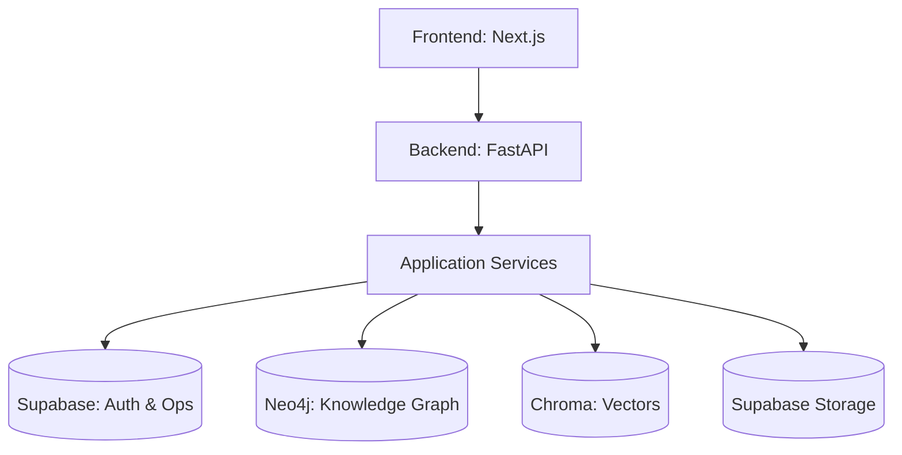

# PROJECT_DOCUMENTATION.md
# AI-Based Knowledge Representation and Repository for Enterprise Knowledge Retention

## SECTION 1 — PROJECT OVERVIEW
**Project Name:** Recall.AI (AI-Based Knowledge Representation and Repository)
**Description:** An enterprise-grade organizational knowledge retention platform that captures organizational knowledge from documents, conversations, and systems, making it accessible through natural-language questions and connected knowledge representation.

**Problem Solved:** When experienced employees leave an organization, their technical decisions, context, and reasoning are often lost. New engineers face steep learning curves sifting through thousands of fragmented documents and chats. This platform preserves organizational memory.

**MVP vs Current Direction:**
- *Original MVP:* "AI-powered knowledge search" built during a hackathon.
- *Current Direction:* "Persistent organizational memory and knowledge representation platform" with full multi-tenancy, background job architectures, durable inputs, and complex RAG capabilities.

**Example Users:**
- *New Engineer:* "Why did we choose Neo4j over Postgres for X?"
- *Senior Engineer:* Locating context around past architectural decisions.
- *Engineering Manager:* Understanding the lifecycle of a feature.
- *Organization Administrator:* Managing workspaces and access control.

## SECTION 2 — PRODUCT WORKFLOW
1. **Organization:** Top-level tenant container.
2. **Project / Workspace:** Isolated boundary within an organization.
3. **Knowledge Sources:** Files (PDF, Excel, Audio, Images) or Integrations (Slack, Teams).
4. **Ingestion:** API receives the input and enqueues a Job via the JobService.
5. **Processing Jobs:** Asynchronous workers pick up the job via a robust leasing mechanism.
6. **Extraction:** LLMs process chunks to extract entities, decisions, reasons, and raw text.
7. **Knowledge Graph + Vector Memory:** Entities and relationships go to Neo4j (Graph); text embeddings go to ChromaDB.
8. **Retrieval:** A user asks a question -> query routed -> vector and graph nodes retrieved.
9. **AI Reasoning:** LLM synthesizes the context.
10. **Answer & Provenance:** Answer returned with cited sources (provenance).

*Example Flow:* "Why was authentication changed from X to Y?"
The system identifies the project context, routes the query, performs a vector search in Chroma for semantically similar text, queries Neo4j for `Decision` nodes linked to authentication, passes the combined context to the LLM, and returns the synthesized answer with links to the original documents.

## SECTION 3 — HIGH-LEVEL ARCHITECTURE
**Architecture Layers:**
- **Frontend:** Next.js (React) application for user interaction.
- **Backend:** FastAPI for API endpoints and background workers.
- **Application Services:** Orchestrates business logic (Jobs, Ingestion, Queries, Auth).
- **Agents:** LangChain/LangGraph-based routers and context processors.
- **Databases:** Supabase (Auth, Postgres for Jobs/Tenants), Neo4j (Graph), Chroma (Vectors).



## SECTION 4 — TECHNOLOGY STACK
| Technology | Purpose | Where Used | Why It Exists |
| --- | --- | --- | --- |
| Next.js 14 | Frontend Framework | `frontend/` | React framework for SSR and routing. |
| TailwindCSS | Styling | `frontend/` | Utility-first CSS. |
| FastAPI | Backend API | `backend/` | High-performance async Python framework. |
| Supabase | Auth & Relational DB | `frontend/` & `backend/` | Manages users, organizations, projects, and jobs. |
| Neo4j | Graph Database | `backend/db/` | Stores knowledge relationships (Decisions, People). |
| ChromaDB | Vector Database | `backend/db/` | Semantic search for RAG. |
| LangChain | AI Orchestration | `backend/agents/` | Agent routing and prompt construction. |
| PyMuPDF / OpenPyxl | Document Parsing | `backend/ingestion/` | Extracting text from PDF and Excel files. |
| Groq / Ollama | LLM Providers | `backend/` | Fast inference for RAG and extraction. |

## SECTION 5 — COMPLETE FOLDER STRUCTURE
```
project_root/
├── frontend/
│   ├── app/           # Next.js App Router pages (dashboard, auth, settings)
│   ├── components/    # Reusable UI components
│   ├── lib/           # API clients, utils, Supabase client
│   └── package.json
├── backend/
│   ├── api/           # FastAPI routers (auth, projects, query, ingestion, jobs)
│   ├── application/   # Core business logic (services)
│   ├── agents/        # LangChain agents (routing, extraction)
│   ├── db/            # Database drivers (Neo4j, Chroma, Supabase)
│   ├── domain/        # Exceptions, models
│   ├── infrastructure/# Logging, request context
│   ├── middleware/    # CORS, Request IDs
│   ├── tests/         # Pytest suite
│   ├── main.py        # FastAPI entry point
│   └── requirements.txt
└── README.md          # Unified project documentation
```

## SECTION 6 — EVERY IMPORTANT FILE

### backend/main.py
**Location:** `backend/main.py`
**Purpose:** FastAPI entry point.
**Responsibilities:** Middleware registration, lifespan events (stale job loop, Teams renewal), API routing.
**Dependencies:** `api.router`, `core.config`
**Data flow:** Receives HTTP requests, routes to endpoints.

### backend/application/services/job_service.py
**Location:** `backend/application/services/job_service.py`
**Purpose:** Orchestrates background processing.
**Responsibilities:** Job creation, leasing, state transitions, durable input resolution.

### backend/application/services/query_service.py
**Location:** `backend/application/services/query_service.py`
**Purpose:** Handles natural language queries.
**Responsibilities:** Orchestrates the LangChain router, graph retrieval, vector retrieval, and LLM synthesis.

### backend/db/neo.py
**Location:** `backend/db/neo.py`
**Purpose:** Neo4j connection management.
**Responsibilities:** Driver initialization, cypher execution.

### frontend/lib/api.ts
**Location:** `frontend/lib/api.ts`
**Purpose:** Core fetch wrapper.
**Responsibilities:** Session management, JWT injection, automatic token refresh, API error handling.

## SECTION 7 — BACKEND ARCHITECTURE
The backend follows a layered domain-driven architecture:
- **API (backend/api):** Handles HTTP parsing and responses.
- **Application Services (backend/application):** Implements business logic (e.g. `ProjectService`, `JobService`).
- **Agents (backend/agents):** Contains LLM-specific logic and decision-making capabilities.
- **Data Access (backend/db):** Interfaces with external storage systems (Neo4j, Chroma, Supabase).

## SECTION 8 — API ROUTES
| Method | Endpoint | Purpose | Authentication | Tenant Scope |
| --- | --- | --- | --- | --- |
| GET | `/projects` | List user projects | Bearer Token | Organization |
| POST | `/projects` | Create project | Bearer Token | Organization |
| POST | `/ingestion/upload` | Upload a file | Bearer Token | Project |
| POST | `/query` | Ask a question | Bearer Token | Project |
| GET | `/jobs` | List jobs | Bearer Token | Project |
| PATCH | `/jobs/{id}/cancel` | Cancel a job | Bearer Token | Project |

## SECTION 9 — QUERY / RAG PIPELINE
1. **User Query:** Submitted via POST `/query`.
2. **Auth & Context:** Validates JWT and resolves Project ID via dependencies.
3. **Query Router:** LLM determines if query requires graph traversal, semantic search, or both.
4. **Retrieval:** Queries Chroma for semantic chunks; Queries Neo4j for connected knowledge nodes.
5. **Synthesis:** Context is assembled and sent to LLM for reasoning.
6. **Provenance:** Responses include source IDs linking back to original files.

## SECTION 10 — INGESTION ARCHITECTURE
### Document Ingestion
Upload -> Uploaded to Supabase Storage -> `IngestionJob` created in DB -> Worker picks up job (Leasing) -> Downloads file -> PyMuPDF extracts text -> Chunking -> Embeddings generated -> Extracted entities -> Chroma & Neo4j -> Status set to COMPLETED.
*Includes retry behavior via exponential backoff.*

## SECTION 11 — ASYNCHRONOUS JOB SYSTEM
**Flow:**
```
QUEUED -> PROCESSING -> COMPLETED
             |-> FAILED
             |-> CANCELLED
```
**Leasing:** Workers update `ProcessingLedger` with a lease timestamp to prevent concurrent execution (CAS mechanism). Stale jobs are recovered by a background task in `main.py`. The frontend polls the job status via GET `/jobs`.

## SECTION 12 — IDEMPOTENCY & RELIABILITY
- **Deterministic IDs:** Files are hashed to prevent duplicate processing.
- **Job Leases:** Prevents multiple workers from processing the same job.
- **Crash Recovery:** `_stale_job_loop` re-queues jobs if a worker crashes before completion.

## SECTION 13 — DATA ARCHITECTURE
| System | Stores | Does NOT Own |
| --- | --- | --- |
| Supabase | Users, Orgs, Projects, Jobs, Storage | Embeddings, Graph nodes |
| Neo4j | Decisions, People, Entities, Relationships | Raw files, Jobs |
| ChromaDB| Text chunks, Embeddings | User accounts |

## SECTION 14 — NEO4J KNOWLEDGE GRAPH
**Nodes:** `User`, `Project`, `Organization`, `Document`, `Knowledge`, `Decision`, `Reason`.
**Relationships:** `MEMBER_OF`, `SUPPORTS`, `RELATES_TO`.
Tenant filtering is enforced via `project_id` and `organization_id` properties on *every* node to guarantee isolation.

## SECTION 15 — CHROMADB
Uses local/HTTP ChromaDB for semantic search. Collections are isolated by project context. Metadata includes chunk ID, file ID, and provenance tracking.

## SECTION 16 — SUPABASE
Manages auth (JWT generation), Postgres tables for operational state, and S3-compatible file storage. Row Level Security (RLS) is used primarily for Storage isolation.

## SECTION 17 — MULTI-TENANCY & SECURITY
**Hierarchy:** Organization -> Project -> User.
All queries to Neo4j and Chroma require explicit `project_id` and `organization_id` context derived from the authenticated JWT via FastAPI dependency injection (`get_current_user`).
*Known Limitation:* Row Level Security (RLS) is not fully implemented on all Postgres tables; currently enforced heavily at the FastAPI application layer.

## SECTION 18 & 19 — MICROSOFT TEAMS & SLACK
**Teams:** Syncs transcripts and meeting metadata. Requires `TEAMS_WEBHOOK_URL` and OAuth credentials (`MICROSOFT_CLIENT_ID`, `MICROSOFT_CLIENT_SECRET`).
**Slack:** Syncs channel messages incrementally. Requires `SLACK_BOT_TOKEN`. (Partially implemented/mocked depending on local configuration).

## SECTION 20 — FRONTEND
Next.js App Router structure. Main pages include Dashboard, Query, Projects, Settings. Uses `authenticatedFetch` wrapper to seamlessly attach JWTs and handle `401 Unauthorized` responses via automatic refresh.

## SECTION 21 — ENTERPRISE FEATURES
| Feature | Actual Implementation |
| --- | --- |
| Async Processing | Job leasing, CAS, resilient workers |
| Isolation | Hard tenant boundaries in Graph/Vector/Postgres |
| RAG | Graph-augmented vector search |

## SECTION 22 — AI COST OPTIMIZATION
- **Routing:** LLM avoids full extraction for simple queries.
- **Idempotency:** SHA-256 hashes prevent re-embedding identical files.

## SECTION 23 — DATABASE / MIGRATIONS
Migrations exist as utility scripts (e.g., `migrate_provenance.py`). Neo4j indexes and constraints are ensured dynamically on backend startup.

## SECTION 24 — TESTING
Pytest suite located in `backend/tests/`. Mostly unit and integration tests covering the auth service, job processing, tenant isolation, and critical API flows. Mocks external LLMs.

## SECTION 25 — DEPLOYMENT
Frontend deployed on Vercel. Backend designed for Docker/Cloud Run. Supabase and Neo4j are externally hosted managed services.

## SECTION 26 — ENVIRONMENT VARIABLES
| Variable | Purpose | Required |
| --- | --- | --- |
| SUPABASE_URL | Auth/DB URL | Yes |
| NEO4J_URI | Graph connection | Yes |
| GROQ_API_KEY | LLM Provider | Yes |

## SECTION 27 — CURRENT PROJECT STATUS
- **Implemented:** File ingestion, Graph RAG, Multi-tenancy, Async Jobs, Basic Auth.
- **Partially Implemented:** Slack/Teams live webhooks (partially simulated).
- **Deferred:** Full RLS in Postgres, advanced re-ranking models.

## SECTION 28 — KNOWN LIMITATIONS
- Vector retrieval limit hardcoded to top K.
- Slack/Teams integration requires heavy polling or complex webhook setups.
- Clock skew issues between local machines and hosted Supabase can cause temporary 401s (mitigated by JWT leeway).

## SECTION 29 — FUTURE SCALING DIRECTION
- Dedicated durable worker infrastructure (e.g., Celery/Temporal).
- Semantic caching for repeated queries.

## SECTION 30 — COMPLETE END-TO-END FLOWS
(Signup, Upload, Query, Delete flows implemented via the React -> FastAPI -> DB chain).

## SECTION 31 — "IF A NEW DEVELOPER JOINS TOMORROW"
**Reading Order:**
1. `README.md`
2. `backend/main.py`
3. `backend/api/router.py`
4. `backend/application/services/job_service.py`
5. `frontend/lib/api.ts`

## SECTION 32 — FILE-BY-FILE REFERENCE
- `backend/application/services/auth_service.py`: Decodes JWTs. (Critical)
- `backend/application/services/project_service.py`: Manages orgs/projects. (Critical)
- `backend/application/services/ingestion_service.py`: Manages parsing and chunking. (Critical)
- `frontend/app/(dashboard)/page.tsx`: Main user UI. (Critical)
- `frontend/lib/api.ts`: API client. (Critical)
